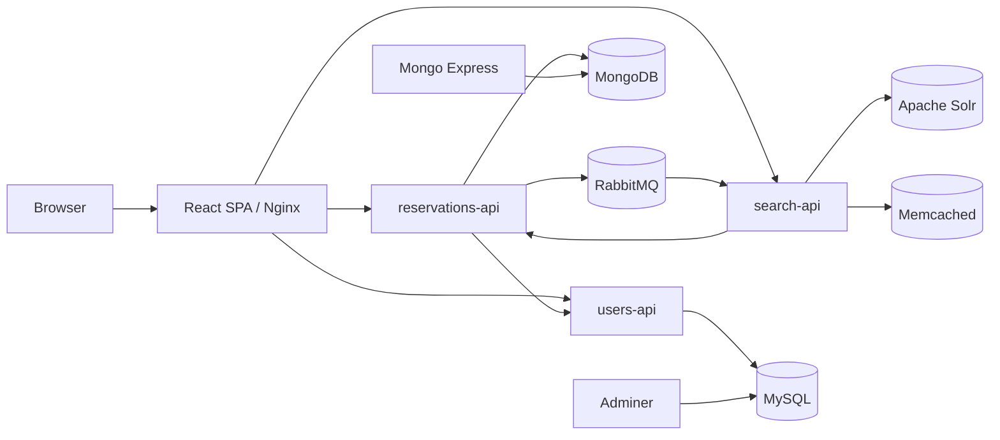
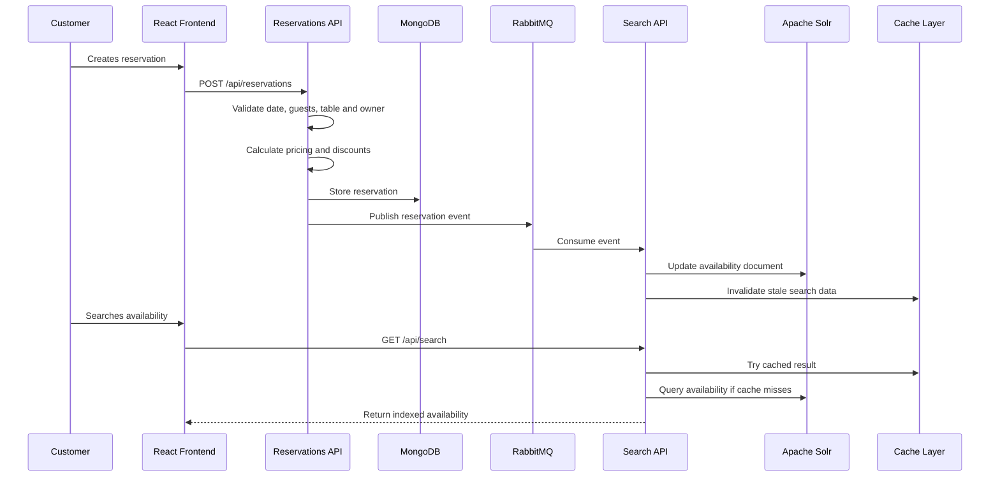

<p align="center">
  
</p>

<h1 align="center">SlotTable</h1>

<p align="center">
  <strong>A distributed restaurant reservation platform built with React, Go microservices, RabbitMQ, Solr, MongoDB, MySQL and Docker.</strong><br>
  Not a CRUD demo. A service-oriented system with authentication, reservation orchestration, search indexing, caching and admin workflows.
</p>

<p align="center">
  
  
  
  
  
  
</p>

---

## The Short Version

SlotTable is a full-stack reservation system designed as a realistic distributed application.

A customer can search available tables, create an account, book a reservation, review reservation details and manage their bookings. An administrator can manage reservations and restaurant table inventory. Behind that simple product surface, the system is split into independent services with separate databases, asynchronous messaging, a search read model, caching and containerized infrastructure.

```text
┌─────────────────────────────────────────────────────────────────────────────┐
│                                  SlotTable                                  │
│                                                                             │
│  Browser                                                                    │
│    │                                                                        │
│    ▼                                                                        │
│  React + Vite Frontend                                                      │
│    │                                                                        │
│    ├── users-api          → authentication, JWT, roles, user lookup          │
│    ├── reservations-api   → reservations, tables, pricing, lifecycle         │
│    └── search-api         → Solr search, availability read model, caching    │
│                                                                             │
│  Data and infrastructure                                                     │
│    ├── MySQL       → users                                                   │
│    ├── MongoDB     → reservations and tables                                 │
│    ├── RabbitMQ    → reservation change events                               │
│    ├── Apache Solr → indexed table availability                              │
│    └── Memcached   → distributed search cache                                │
└─────────────────────────────────────────────────────────────────────────────┘
```

---

## Why This Project Exists

Most reservation projects stop at `POST /reservation` and a database insert.

SlotTable goes further: it models the architectural problems that appear when a reservation platform starts to behave like a real product.

- Writes and reads have different needs.
- Reservation changes must update search results reliably.
- Availability queries need to be fast.
- Admin and customer flows require different authorization rules.
- Data does not always belong in one database.
- Frontend state must stay synchronized with backend mutations.
- The whole system must run reproducibly from one command.

This repository is my attempt to build that system end to end.

---

## What SlotTable Does

### For customers

- Register and log in.
- Search table availability by date, meal type and capacity.
- Create reservations with guests, date/time, table and special requests.
- View reservation details.
- View personal reservations.
- Cancel reservations.
- Use a polished responsive interface with light/dark theme support.

### For administrators

- Access an admin-only dashboard.
- Review all reservations.
- Edit reservation data.
- Confirm or cancel reservations.
- Manage table inventory.
- Create, update and delete restaurant tables.

### For the system

- Issue and validate JWT tokens.
- Persist users in MySQL.
- Persist reservations and tables in MongoDB.
- Publish reservation lifecycle events through RabbitMQ.
- Consume events in the search service.
- Maintain a Solr read model for table availability.
- Cache search responses locally and through Memcached.
- Reindex the search model when needed.
- Run the full environment with Docker Compose.

---

## Architecture



---

## Reservation Lifecycle



---

## Service Map

| Service | Port | Main responsibility | Storage / dependency |
|---|---:|---|---|
| `frontend` | `3000` | React SPA served through Nginx | Calls all APIs |
| `users-api` | `8080` | Users, login, JWT, roles | MySQL |
| `reservations-api` | `8081` | Reservations, tables, pricing, lifecycle events | MongoDB, RabbitMQ, users-api |
| `search-api` | `8082` | Availability search, Solr indexing, cache, reindexing | Solr, Memcached, RabbitMQ |
| `users-db` | `3307` | User database | MySQL 8 |
| `reservations-mongodb` | `27017` | Reservation database | MongoDB 7 |
| `reservations-rabbitmq` | `5672`, `15672` | Event broker and management UI | RabbitMQ |
| `search-solr` | `8983` | Search engine | Apache Solr 9 |
| `search-memcached` | `11211` | Distributed cache | Memcached |
| `adminer` | `18080` | MySQL web client | Adminer |
| `mongo-express` | `18081` | MongoDB web client | Mongo Express |

---

## Engineering Decisions That Matter

| Problem | Decision | Why it matters |
|---|---|---|
| User data and reservation data have different shapes | MySQL for users, MongoDB for reservations | Demonstrates polyglot persistence and domain-based storage choices |
| Search should not depend directly on transactional queries | Solr read model | Keeps availability search optimized and independent from reservation writes |
| Reservation changes must propagate across services | RabbitMQ events | Introduces asynchronous synchronization and decoupled services |
| Search results can be expensive and repetitive | Local cache + Memcached | Shows layered caching and invalidation strategy |
| Frontend needs server state consistency | TanStack React Query | Handles fetching, mutation invalidation and loading states cleanly |
| Admin features must not be public | PrivateRoute + AdminRoute + JWT role checks | Separates authentication from authorization |
| The system should run anywhere | Docker Compose | Reproducible development environment with all dependencies included |

---

## Tech Stack

### Frontend

| Tool | Purpose |
|---|---|
| React 19 | User interface |
| Vite 7 | Development server and build tooling |
| React Router DOM 7 | Client-side routing |
| TanStack React Query | Server-state management |
| Axios | API clients and interceptors |
| React Hook Form | Forms |
| React Hot Toast | User feedback |
| TailwindCSS | Styling system |
| Lucide React | Icons |
| Nginx | Static delivery inside Docker |

### Backend

| Tool | Purpose |
|---|---|
| Go | Backend services |
| MySQL 8 | User persistence |
| MongoDB 7 | Reservation and table persistence |
| RabbitMQ | Reservation events |
| Apache Solr 9 | Search and availability indexing |
| Memcached | Distributed cache |
| Docker Compose | Local orchestration |

---

## Dynamic Pricing

SlotTable calculates reservation pricing from business rules instead of storing arbitrary static totals.

| Meal type | Base price per person |
|---|---:|
| Breakfast | `15` |
| Lunch | `25` |
| Dinner | `40` |
| Event | `75` |

Discount rules:

| Rule | Discount |
|---|---:|
| Dinner before 18:00 | `10%` |
| Monday to Thursday | `5%` |
| Simulated loyal customer rule | `5%` |
| Group discount from 4 guests | `+5%` every 2 additional guests |

The frontend mirrors this logic for display purposes, while the reservation service owns the business calculation.

---

## API Surface

### Users API

| Method | Endpoint | Description |
|---|---|---|
| `POST` | `/api/users/register` | Register user |
| `POST` | `/api/users/login` | Authenticate user |
| `GET` | `/api/users/{id}` | Retrieve user by ID |

### Reservations API

| Method | Endpoint | Description |
|---|---|---|
| `GET` | `/api/reservations` | List reservations |
| `POST` | `/api/reservations` | Create reservation |
| `GET` | `/api/reservations/user/{userId}` | List reservations by user |
| `GET` | `/api/reservations/{id}` | Retrieve reservation |
| `PUT` | `/api/reservations/{id}` | Update reservation |
| `DELETE` | `/api/reservations/{id}` | Delete reservation |
| `POST` | `/api/reservations/{id}/confirm` | Confirm reservation |
| `POST` | `/api/reservations/{id}/cancel` | Cancel reservation |
| `GET` | `/api/tables` | List tables |
| `GET` | `/api/tables/{id}` | Retrieve table |
| `GET` | `/api/tables/available` | List available tables |
| `POST` | `/api/admin/tables` | Create table |
| `PUT` | `/api/admin/tables/{id}` | Update table |
| `DELETE` | `/api/admin/tables/{id}` | Delete table |

### Search API

| Method | Endpoint | Description |
|---|---|---|
| `GET` | `/api/search` | Search table availability |
| `GET` | `/api/search/{id}` | Retrieve indexed availability document |
| `GET` | `/api/search/stats` | Search/index stats |
| `POST` | `/api/search/reindex` | Trigger manual reindex |

---

## Repository Structure

```text
.
├── frontend/
│   ├── public/
│   │   └── logo.svg
│   ├── src/
│   │   ├── api/                 # Axios clients for users, reservations, search and tables
│   │   ├── components/          # Reusable UI grouped by feature
│   │   │   ├── admin/
│   │   │   ├── auth/
│   │   │   ├── common/
│   │   │   ├── reservation/
│   │   │   └── search/
│   │   ├── context/             # AuthContext and ThemeContext
│   │   ├── hooks/               # useAuth, useReservations, useTheme
│   │   ├── pages/               # Route-level screens
│   │   ├── routes/              # Public, private and admin route guards
│   │   └── utils/               # Constants, formatters and pricing helpers
│   ├── Dockerfile
│   ├── nginx.conf
│   ├── package.json
│   └── vite.config.js
│
├── users-api/
│   ├── cmd/server/              # Service entrypoint
│   ├── internal/
│   │   ├── auth/                # JWT generation and validation
│   │   ├── config/              # Environment configuration
│   │   ├── crypto/              # Password hashing
│   │   ├── db/                  # MySQL connection
│   │   ├── domain/              # User entity and contracts
│   │   ├── repository/          # User repository
│   │   ├── service/             # User registration, login and lookup
│   │   └── transport/http/      # HTTP endpoints
│   └── scripts/                 # Database and local scripts
│
├── reservations-api/
│   ├── cmd/api/                 # Service entrypoint
│   ├── internal/
│   │   ├── controller/          # Reservation and table controllers
│   │   ├── db/                  # MongoDB connection
│   │   ├── domain/              # Reservation, table and pricing models
│   │   ├── middleware/          # Auth middleware
│   │   ├── repository/          # MongoDB repositories
│   │   ├── service/             # Reservation, table, user-client and RabbitMQ logic
│   │   └── transport/http/      # HTTP routing
│   └── scripts/                 # E2E test scripts
│
├── search-api/
│   ├── cmd/api/                 # Service entrypoint
│   ├── internal/
│   │   ├── cache/               # Local, distributed and dual-cache layers
│   │   ├── config/              # Environment configuration
│   │   ├── domain/              # Search documents and table availability model
│   │   ├── rabbitmq/            # Reservation event consumer
│   │   ├── repository/          # Search repository and Solr implementation
│   │   ├── service/             # Search, sync, query builder and API clients
│   │   ├── solr/                # Solr client and schema setup
│   │   └── transport/http/      # HTTP routing
│   └── scripts/                 # Solr initialization scripts
│
├── docker-compose.yml           # Full system orchestration
├── create-admin.sh              # Development admin helper
├── makefile                     # Utility commands
└── README.md
```

---

## Running the System

### Prerequisites

- Docker
- Docker Compose
- Node.js, only if running the frontend outside Docker
- Go, only if running backend services outside Docker

### Start everything

```bash
docker compose up --build
```

### Stop everything

```bash
docker compose down
```

### Stop and remove volumes

```bash
docker compose down -v
```

---

## Local URLs

| Resource | URL |
|---|---|
| Frontend | `http://localhost:3000` |
| Users API | `http://localhost:8080` |
| Reservations API | `http://localhost:8081` |
| Search API | `http://localhost:8082` |
| RabbitMQ Management | `http://localhost:15672` |
| Solr Admin | `http://localhost:8983` |
| Adminer | `http://localhost:18080` |
| Mongo Express | `http://localhost:18081` |

Development admin user seeded by Docker Compose:

```text
Email:    admin@admin.com
Password: 12345678
```

RabbitMQ development credentials:

```text
Username: admin
Password: admin
```

---

## Frontend Environment

Create `frontend/.env` from `frontend/.env.example`:

```env
VITE_API_URL=http://localhost:8080
VITE_RESERVATIONS_API_URL=http://localhost:8081
VITE_SEARCH_API_URL=http://localhost:8082
VITE_APP_NAME=Restaurant Reservations
```

Run locally:

```bash
cd frontend
npm install
npm run dev
```

Build:

```bash
npm run build
```

Lint:

```bash
npm run lint
```

---

## Running Tests

Run all Go tests per service:

```bash
cd users-api
go test ./...

cd ../reservations-api
go test ./...

cd ../search-api
go test ./...
```

Run frontend lint:

```bash
cd frontend
npm run lint
```

Generate Go coverage from a service:

```bash
go test -v -coverprofile=coverage.out ./...
go tool cover -html=coverage.out -o coverage.html
```

---

## What This Shows Technically

This repository demonstrates practical knowledge of:

- Full-stack architecture.
- Microservice boundaries.
- REST API design.
- JWT authentication.
- Role-based access control.
- Repository pattern.
- Business-rule modeling.
- Event-driven synchronization.
- Search read models.
- Cache layering and invalidation.
- Dockerized infrastructure.
- Frontend protected routes.
- Server-state synchronization with React Query.
- Automated backend testing.
- Multi-database system design.

---

## What I Would Improve Next

This is a strong architecture prototype. The next engineering steps would be:

- Add OpenAPI documentation for each service.
- Add integration tests running against Docker Compose.
- Add centralized structured logging.
- Add request tracing across services.
- Add CI pipeline for frontend lint, Go tests and Docker builds.
- Add migration/versioning strategy for MongoDB and Solr schemas.
- Add production-grade secret management.
- Add observability dashboards for cache hit rate, event lag and API latency.

---

## Why This Repository Matters

SlotTable is intentionally built beyond the minimum requirements of a student project.

It combines frontend engineering, backend design, distributed systems concepts and infrastructure orchestration into a single coherent product. The value of the repository is not only that it works, but that it exposes architectural thinking: where to split services, how data moves, how reads are optimized, how writes trigger downstream updates and how the full environment can be reproduced locally.

That is the kind of engineering work I want to keep doing.

